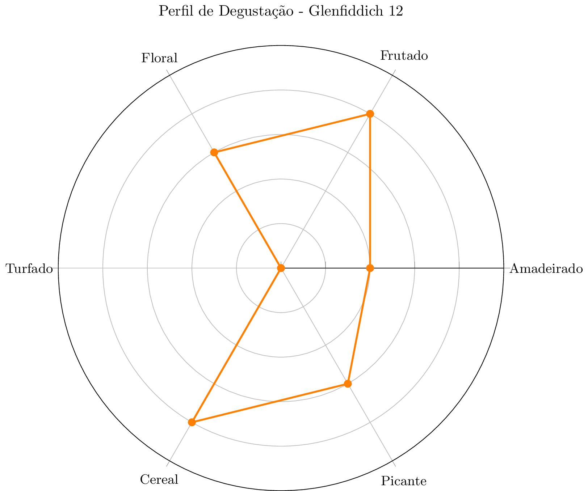

# 🥃 Glenfiddich 12

| Propriedade | Detalhe |
|-------------|---------|
| **Data da Degustação** | 19/11/2025 |
| **Tipo** | Single Malt |
| **Idade** | 12 anos |
| **Destilaria** | Glenfiddich |
| **Cor** | Dourado claro |

---

## 👃 Sem Adição de Água

### Aroma
- Malte
- Floral
- Grama
- Baunilha
- Chocolate

### Sabor
- Malte
- Ameixa

---

## 💧 Com Adição de Água

### Aroma
- Baunilha mais forte
- Doce

### Sabor
- Malte
- Ameixa
- Doce

---

## 📊 Perfil de Degustação

---

## 📝 Notas Finais

*Foi meu primiero whisky single malt para degustação, acho que ainda vou ter que revisitar este whisky quando tiver mais experiência*

---
*Registrado em: 19/11/2025*
